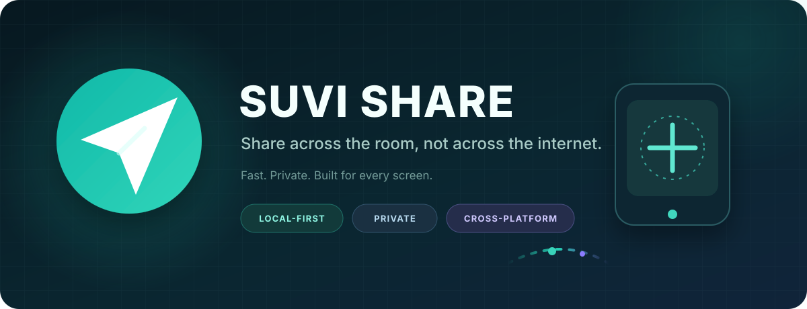
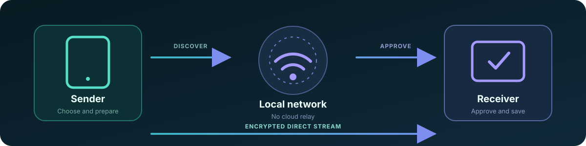
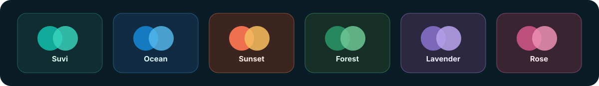

<div align="center">
  
</div>

<div align="center">

[](https://github.com/vikas0vks/suvishare/releases/latest)
[](https://github.com/vikas0vks/suvishare/actions/workflows/ci.yml)
[](#download)
[](LICENSE)

<a href="#download"><strong>Download</strong></a>&nbsp;&nbsp;&nbsp;•&nbsp;&nbsp;&nbsp;
<a href="#features"><strong>Features</strong></a>&nbsp;&nbsp;&nbsp;•&nbsp;&nbsp;&nbsp;
<a href="#how-it-works"><strong>How it works</strong></a>&nbsp;&nbsp;&nbsp;•&nbsp;&nbsp;&nbsp;
<a href="#build-from-source"><strong>Build</strong></a>

</div>

<br>

<p align="center">
  <strong>Move files directly between nearby devices.</strong><br>
  No account. No cloud storage. No advertising. No analytics.
</p>

<p align="center">
  Suvi Share sends files, folders, photos, videos, music, documents, archives, and text over your local network. It works across Android, Windows, Linux, and modern browsers while keeping transfer control in your hands.
</p>

<br>

## Features

<table>
  <tr>
    <td width="33%" valign="top">
      <br><br>
      <strong>Direct LAN speed</strong><br>
      <sub>Stream device-to-device without first uploading files to a remote server.</sub>
    </td>
    <td width="33%" valign="top">
      <br><br>
      <strong>Category-first picker</strong><br>
      <sub>Browse General, Documents, Photos, Videos, Music, Compressed, and Other.</sub>
    </td>
    <td width="33%" valign="top">
      <br><br>
      <strong>Resilient discovery</strong><br>
      <sub>Find devices through multicast, register-back, subnet scan, manual address, or QR.</sub>
    </td>
  </tr>
  <tr>
    <td width="33%" valign="top">
      <br><br>
      <strong>Explicit trust</strong><br>
      <sub>Ask every time, remember trusted devices, require a PIN, or block a peer.</sub>
    </td>
    <td width="33%" valign="top">
      <br><br>
      <strong>Reliable transfers</strong><br>
      <sub>Resume interrupted files and optionally verify content with SHA-256 checksums.</sub>
    </td>
    <td width="33%" valign="top">
      <br><br>
      <strong>Web Share</strong><br>
      <sub>Send and receive from a modern browser without installing another application.</sub>
    </td>
  </tr>
  <tr>
    <td width="33%" valign="top">
      <br><br>
      <strong>Personal themes</strong><br>
      <sub>Choose six palettes with light, dark, and system appearance modes.</sub>
    </td>
    <td width="33%" valign="top">
      <br><br>
      <strong>Release updates</strong><br>
      <sub>Check GitHub Releases automatically or on demand, then install with platform controls.</sub>
    </td>
    <td width="33%" valign="top">
      <br><br>
      <strong>Offline localization</strong><br>
      <sub>Use the interface in English or हिन्दी with all language assets bundled locally.</sub>
    </td>
  </tr>
</table>

<br>

## Download

<p align="center"><strong>Choose your platform. Each button downloads the matching package from the latest release.</strong></p>

<table>
  <tr>
    <td width="33%" align="center">
      <a href="https://github.com/vikas0vks/suvishare/releases/latest/download/SuviShare-android-arm64.apk">
        
      </a>
    </td>
    <td width="33%" align="center">
      <a href="https://github.com/vikas0vks/suvishare/releases/latest/download/SuviShare-windows-x64-setup.exe">
        
      </a>
    </td>
    <td width="33%" align="center">
      <a href="https://github.com/vikas0vks/suvishare/releases/latest/download/SuviShare-linux-amd64.deb">
        
      </a>
    </td>
  </tr>
</table>

<p align="center">
  <a href="https://github.com/vikas0vks/suvishare/releases/latest/download/SuviShare-android-universal.apk"><strong>Universal Android APK</strong></a>
  &nbsp;&nbsp;•&nbsp;&nbsp;
  <a href="https://github.com/vikas0vks/suvishare/releases/latest/download/SuviShare-linux-x64.tar.gz"><strong>Portable Linux archive</strong></a>
  &nbsp;&nbsp;•&nbsp;&nbsp;
  <a href="https://github.com/vikas0vks/suvishare/releases/latest/download/SHA256SUMS.txt"><strong>SHA-256 checksums</strong></a>
  &nbsp;&nbsp;•&nbsp;&nbsp;
  <a href="https://github.com/vikas0vks/suvishare/releases/latest"><strong>All release files</strong></a>
</p>

<p align="center"><sub>These permanent links always follow the newest published GitHub release.</sub></p>

Every release includes SHA-256 checksums. Android packages are release-signed; signing material remains in protected repository secrets and is never committed.

> **Update control stays with you.** Suvi Share can check `vikas0vks/suvishare` Releases at most once every 24 hours, but it never downloads or executes an installer silently. The matching asset opens in your browser and the operating system handles installation with its normal confirmation and security checks.

Automatic checks can be disabled, and a manual check is available under **Settings → Software updates**. Only release metadata is requested; transferred files, contacts, analytics, and device identity are not sent.

<br>

## How it works

<div align="center">
  
</div>

| Stage | What happens |
|:--|:--|
| Discover | Devices find one another through local multicast, register-back, scan, manual address, or QR |
| Approve | The receiver accepts, declines, or confirms the session with a PIN |
| Transfer | TLS-protected bytes stream directly to disk, with progress and resume support |

App-to-app traffic uses TLS on port `53317`. Browser Web Share uses port `53318` and can be protected by an expiring session PIN. Files stream to disk instead of being loaded fully into memory.

<br>

## Made to feel like yours

<div align="center">
  
</div>

Each palette works in light, dark, or system mode, so the same fast transfer flow fits the screen and environment you use.

<br>

## Build from source

### Requirements

- Flutter `3.47.0` or a newer compatible stable release
- Dart `3.13.0` or newer
- JDK 17 and Android SDK 36 for Android builds
- Visual Studio C++ desktop tools for Windows builds
- `clang`, `cmake`, `ninja-build`, `pkg-config`, GTK 3, and Ayatana AppIndicator development packages for Linux

### Verify the application

```bash
git clone https://github.com/vikas0vks/suvishare.git
cd suvishare/app
flutter pub get
flutter gen-l10n
flutter analyze
flutter test
```

Run on a connected target:

```bash
flutter run -d <device-id>
```

Verify the protocol package separately:

```bash
cd packages/suvi_core
dart pub get
dart analyze
dart test
```

Release signing is fail-closed by design. Android release builds require a local `app/android/key.properties` file and keystore; both are ignored by Git. Tagged release workflows receive the same values through protected Actions secrets.

<br>

## Project structure

```text
app/                    Flutter application and platform runners
packages/suvi_core/     Pure Dart protocol, discovery, server, and client
packaging/windows/      Windows installer source and build script
packaging/linux/        Linux package source and build script
.github/workflows/      Verification and tagged-release automation
```

## Security by design

- TLS identity fingerprints are generated and stored locally.
- Trusted-device actions require verified peer identity.
- Session and per-file tokens are random, sender-bound, and invalidated on cancel.
- Filenames are sanitized and final paths remain inside the selected save directory.
- Metadata, request counts, file sizes, and concurrent sessions are bounded.
- Web Share offers expire and may require a fresh session PIN.
- Update responses are size-bounded and only trusted HTTPS release links are accepted.

Please report vulnerabilities privately using the process in [SECURITY.md](SECURITY.md).

## License

Suvi Share is available under the [MIT License](LICENSE).

<br>

<div align="center">
  <br><br>
  <strong>Built with care by <a href="https://github.com/vikas0vks">vikas0vks</a>.</strong><br>
  <sub>Private sharing should feel simple.</sub>
</div>
